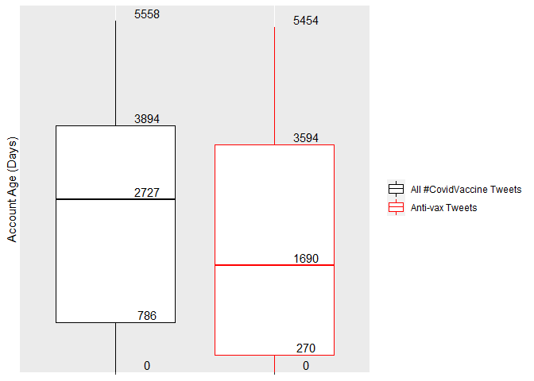

## R Markdown

This is an R Markdown document. Markdown is a simple formatting syntax
for authoring HTML, PDF, and MS Word documents. For more details on
using R Markdown see <http://rmarkdown.rstudio.com>.

When you click the **Knit** button a document will be generated that
includes both content as well as the output of any embedded R code
chunks within the document. You can embed an R code chunk like this:

    library(tidyverse)

    ## -- Attaching packages --------------------------------------- tidyverse 1.3.1 --

    ## v ggplot2 3.3.5     v purrr   0.3.4
    ## v tibble  3.1.6     v dplyr   1.0.7
    ## v tidyr   1.1.4     v stringr 1.4.0
    ## v readr   2.1.1     v forcats 0.5.1

    ## -- Conflicts ------------------------------------------ tidyverse_conflicts() --
    ## x dplyr::filter() masks stats::filter()
    ## x dplyr::lag()    masks stats::lag()

    library(stringr)
    library(patchwork)
    library(shiny)

    data <- read.csv('data/covidvaccine.csv')

    anti_vax_tags <- c('plandemic', 'scamdemic', 'wakeup', 'covid1984', 'covidhoax', 'nomasks', '#nomask', 'COVIDVaccineInjuries')

    filtered <- data %>%
      mutate(anti_vax = ifelse(grepl(anti_vax_tags[1], hashtags, ignore.case = TRUE) |
                                 grepl(anti_vax_tags[2], hashtags, ignore.case = TRUE) |
                                 grepl(anti_vax_tags[3], hashtags, ignore.case = TRUE) |
                                 grepl(anti_vax_tags[4], hashtags, ignore.case = TRUE) |
                                 grepl(anti_vax_tags[5], hashtags, ignore.case = TRUE) |
                                 grepl(anti_vax_tags[6], hashtags, ignore.case = TRUE) |
                                 grepl(anti_vax_tags[6], hashtags, ignore.case = TRUE) |
                                 grepl(anti_vax_tags[7], hashtags, ignore.case = TRUE), 
                               1, 0))

    check_tag = c('autism', 'eugenics', 'PuppetState', 'nwo', 'Great Reset', 'wakeup')

    shear_age <- filtered[8113:nrow(filtered),]

    filter_age <- shear_age %>% 
      mutate(format_date = as.Date(date, format= "%Y-%m-%d")) %>% 
      mutate(format_created = as.Date(user_created, format= "%Y-%m-%d")) %>% 
      mutate(acc_age = as.numeric(difftime(as.Date(format_date), as.Date(format_created), units = 'days'))) %>% 
      select(acc_age, anti_vax)

    specify_decimal <- function(x, k) {
      trimws(format(round(x, k), nsmall=k))
      
    } 

        
      
    age_plot <- ggplot(filter_age, aes(y = acc_age, x = as.factor(anti_vax), color = as.factor(anti_vax))) +
      geom_boxplot() + 
      stat_summary(fun = "quantile",
                   geom = "text",
                   aes(label = trimws(format(round(as.numeric(sprintf("%1.1f", ..y..)), 0), nsmall = 0))),
                   position = position_nudge(x = 0.2, y = 125),
                   color = "black") +
      scale_y_discrete(name = "Account Age (Days)", labels = NULL, expand = expansion(mult = c(0, 0.02))) +
      scale_color_manual(name = "", values = c("black", "red"), labels = c("All #CovidVaccine Tweets", "Anti-vax Tweets")) + 
      scale_x_discrete(name = NULL, labels = NULL)
      
    age_plot

    ## Warning: Removed 35 rows containing non-finite values (stat_boxplot).

    ## Warning: Removed 35 rows containing non-finite values (stat_summary).

    conspiracy_data <- shear_age %>% 
      mutate(conspiracy = ifelse(grepl(check_tag[1], hashtags, ignore.case = TRUE) | 
           grepl(check_tag[2], hashtags, ignore.case = TRUE) |
           grepl(check_tag[3], hashtags, ignore.case = TRUE) |
           grepl(check_tag[4], hashtags, ignore.case = TRUE) |
           grepl(check_tag[5], hashtags, ignore.case = TRUE), 1, 0))

    cons_group <- conspiracy_data %>% 
      group_by(anti_vax) %>% 
      summarise(mean = mean(conspiracy))
    cons_group

    ## # A tibble: 2 x 2
    ##   anti_vax     mean
    ##      <dbl>    <dbl>
    ## 1        0 0.000933
    ## 2        1 0.0434
